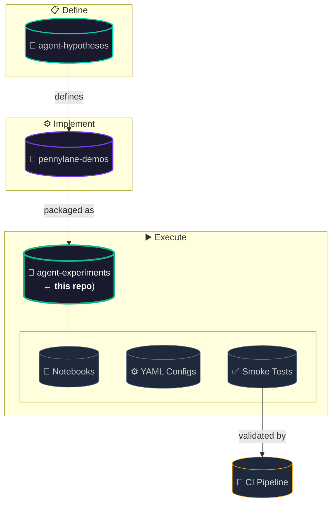
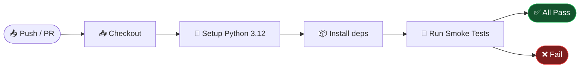

<p align="center">
  <picture>
    <source media="(prefers-color-scheme: dark)" srcset="assets/sticker.png">
    
  </picture>
</p>

<h1 align="center">📓 PennyLane Agent Experiments</h1>

<p align="center">
  <a href="https://github.com/NullLabTests/pennylane-agent-experiments/actions/workflows/ci-smoke.yml">
    
  </a>
  <a href="LICENSE">
    
  </a>
  <a href="https://pennylane.ai">
    
  </a>
  <a href="https://www.python.org/">
    
  </a>
  <a href="https://github.com/NullLabTests/pennylane-agent-hypotheses">
    
  </a>
  <a href="https://github.com/NullLabTests/pennylane-demos">
    
  </a>
  <a href="https://github.com/NullLabTests/pennylane-agent-experments/pulse">
    
  </a>
</p>

<p align="center">
  <b>Runnable Jupyter notebooks</b> for agent-generated hypotheses about quantum machine learning with <a href="https://pennylane.ai">PennyLane</a>.<br/>
  Each experiment is packaged as a 📓 notebook, ⚙️ config, and ✅ smoke test — validated in CI.
</p>

<br/>

---

## 🎯 Overview

This repository provides **executable experiments** that implement the hypotheses defined in the <a href="https://github.com/NullLabTests/pennylane-agent-hypotheses"></a> project. Each experiment is self-contained and designed for reproducibility.

<br/>

### 🔗 Ecosystem



<br/>

---

## 🧪 Experiments

<p align="center">

| ID | Hypothesis | Notebook | Config | Smoke Test |
|:-:|-----------|:--------:|:------:|:----------:|
| **H1** | Local cost functions to mitigate barren plateaus | [](demos/experiments/hypothesis_H1.ipynb) | [](experiments/H1.yaml) | [](tests/test_H1_smoke.py) |
| **H2** | Data re-uploading classifier vs standard feature map | [](demos/experiments/hypothesis_H2.ipynb) | [](experiments/H2.yaml) | [](tests/test_H2_smoke.py) |
| **H3** | Post-Variational Strategies on Non-Convex Landscapes | [](demos/experiments/hypothesis_H3.ipynb) | [](experiments/H3.yaml) | [](tests/test_H3_smoke.py) |
| **H4** | PDE-Constrained Loss Functions Suppress Gradient Vanishing | [](demos/experiments/hypothesis_H4.ipynb) | [](experiments/H4.yaml) | [](tests/test_H4_smoke.py) |
| **H5** | Data-Reuploading with Trainable Scaling on Small Benchmarks | [](demos/experiments/hypothesis_H5.ipynb) | [](experiments/H5.yaml) | [](tests/test_H5_smoke.py) |

</p>

### 📊 Experiment Details

| ID | Device | Qubits | Epochs | Est. Runtime | Key Metric |
|:--:|:------:|:------:|:------:|:------------:|:----------:|
| H1 | `lightning.qubit` | 4 | 50 | 30s | Test accuracy |
| H2 | `lightning.qubit` | 4 | 60 | 45s | Test accuracy |
| H3 | `default.qubit` | 4 | 30 | 60s | Accuracy vs MLP |
| H4 | `default.qubit` | 6 | 80 | 120s | Gradient variance |
| H5 | `lightning.qubit` | 1 | 8 | 90s | Accuracy gap to MLP |

<br/>

---

## 🚀 Quick Start

```bash
# Clone the repo
git clone https://github.com/NullLabTests/pennylane-agent-experiments.git
cd pennylane-agent-experiments

# Install dependencies
pip install pennylane pennylane-lightning matplotlib jupyter scikit-learn

# Launch a specific experiment
jupyter notebook demos/experiments/hypothesis_H1.ipynb
```

<br/>

## ✅ Run Smoke Tests

```bash
# Individual tests
python tests/test_H1_smoke.py
python tests/test_H2_smoke.py

# Or all at once with pytest
pip install pytest
pytest tests/ -q -v --tb=short
```

> Smoke tests run automatically via [GitHub Actions](.github/workflows/ci-smoke.yml) on every push and PR.

<br/>

---

## 📁 Repository Structure

```
📦 pennylane-agent-experiments
├── 📁 demos/
│   └── 📁 experiments/        # 📓 Jupyter notebooks (one per hypothesis)
│       ├── hypothesis_H1.ipynb
│       ├── hypothesis_H2.ipynb
│       ├── hypothesis_H3.ipynb
│       ├── hypothesis_H4.ipynb
│       └── hypothesis_H5.ipynb
├── 📁 experiments/             # ⚙️ YAML configuration files
│   ├── H1.yaml  ─── H5.yaml
├── 📁 tests/                   # ✅ Smoke tests (validated in CI)
│   ├── test_H1_smoke.py ─── test_H5_smoke.py
├── 📁 assets/                  # 🖼️ Visual assets
│   ├── sticker.png
│   └── sticker.svg
├── 📁 results/                 # 📊 Training curves & metrics (gitignored)
├── 📁 .github/workflows/       # 🤖 CI pipeline
│   └── ci-smoke.yml
├── 📄 README.md
├── 📄 LICENSE                  # MIT
└── 📄 .gitignore
```

<br/>

---

## 📊 Results

Per-experiment training curves and metrics are saved to `results/<id>/`:

```
results/
├── H1/
│   ├── run_20260601_120000.json   # Timestamped metrics
│   └── plot.png                   # Training convergence plot
├── H2/
│   ├── run_20260601_120000.json
│   └── plot.png
└── ...
```

> This directory is **gitignored** — generated locally when notebooks are run.

<br/>

---

## 🤖 CI Pipeline



Current status: <a href="https://github.com/NullLabTests/pennylane-agent-experiments/actions/workflows/ci-smoke.yml"></a>

<br/>

---

## 📄 License

**MIT** — see [LICENSE](LICENSE) for details.
