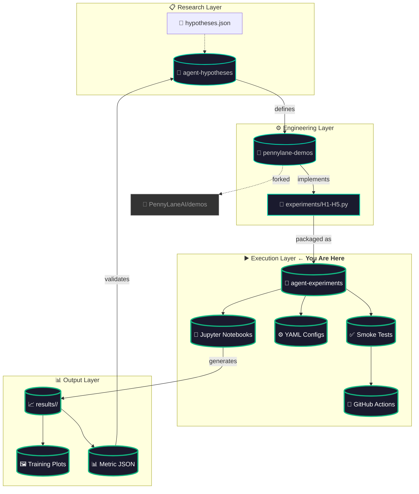
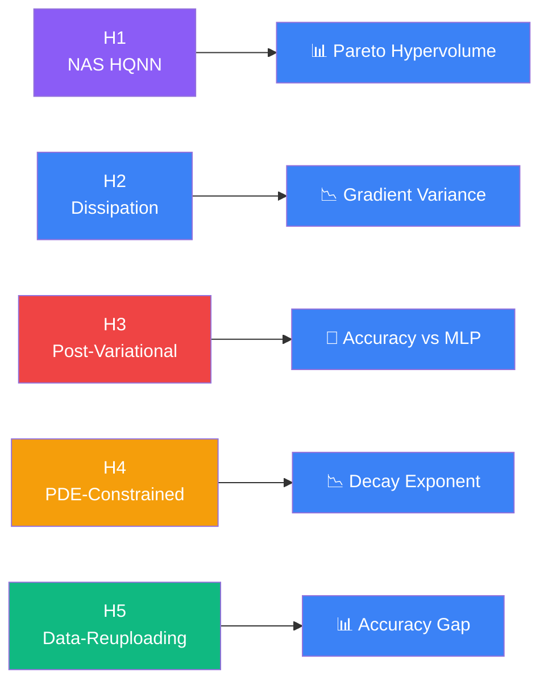
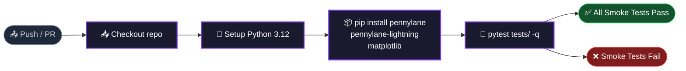
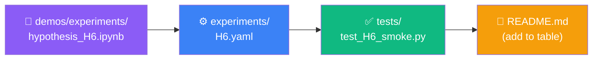

<p align="center">
  <picture>
    <source media="(prefers-color-scheme: dark)" srcset="assets/sticker.png">
    
  </picture>
</p>

<h1 align="center">📓 PennyLane Agent Experiments</h1>

<p align="center">
  <a href="https://github.com/NullLabTests/pennylane-agent-experiments/actions/workflows/ci-smoke.yml">
    
  </a>
  <a href="LICENSE">
    
  </a>
  <a href="https://pennylane.ai">
    
  </a>
  <a href="https://www.python.org/">
    
  </a>
  <a href="https://github.com/NullLabTests/pennylane-agent-hypotheses">
    
  </a>
  <a href="https://github.com/NullLabTests/pennylane-demos">
    
  </a>
  <a href="https://github.com/NullLabTests/pennylane-agent-experiments/pulse">
    
  </a>
  <a href="https://github.com/NullLabTests/pennylane-agent-experiments/issues">
    
  </a>
</p>

<p align="center">
  <b>Runnable Jupyter notebooks</b> for agent-generated hypotheses about quantum machine learning with <a href="https://pennylane.ai">PennyLane</a>.<br/>
  Each experiment: <b>📓 notebook</b> + <b>⚙️ config</b> + <b>✅ smoke test</b> — validated in <b>🤖 CI</b>.
</p>

<br/>

<p align="center">
  
</p>
<p align="center"><sub>Complete experiment lifecycle: Create (notebook + config + test) → Validate (CI smoke tests) → Execute (run notebook) → Analyze (results JSON). All 5 experiments (H1–H5) are complete and ready to run.</sub></p>

<br/>

---

## 🎯 Overview

This repository provides **executable experiments** that bring the hypotheses from <a href="https://github.com/NullLabTests/pennylane-agent-hypotheses"></a> to life. Each experiment is:

- **Self-contained** — install deps and run
- **Reproducible** — YAML configs capture every hyperparameter
- **Tested** — smoke tests run in CI on every commit
- **Extensible** — add a new hypothesis in 3 files

<br/>

---

## 🔗 Ecosystem Architecture



<br/>

---

## 🧪 Experiment Catalog

### All 5 Experiments — Quick Reference

<p align="center">

| ID | Hypothesis | Notebook | Config | Smoke Test | CI Status |
|:--:|-----------|:--------:|:------:|:----------:|:---------:|
| **H1** | Local cost functions to mitigate barren plateaus | [](demos/experiments/hypothesis_H1.ipynb) | [](experiments/H1.yaml) | [](tests/test_H1_smoke.py) | [](https://github.com/NullLabTests/pennylane-agent-experiments/actions) |
| **H2** | Data re-uploading classifier vs standard feature map | [](demos/experiments/hypothesis_H2.ipynb) | [](experiments/H2.yaml) | [](tests/test_H2_smoke.py) | [](https://github.com/NullLabTests/pennylane-agent-experiments/actions) |
| **H3** | Post-variational strategies on non-convex landscapes | [](demos/experiments/hypothesis_H3.ipynb) | [](experiments/H3.yaml) | [](tests/test_H3_smoke.py) | [](https://github.com/NullLabTests/pennylane-agent-experiments/actions) |
| **H4** | PDE-constrained loss functions suppress gradient vanishing | [](demos/experiments/hypothesis_H4.ipynb) | [](experiments/H4.yaml) | [](tests/test_H4_smoke.py) | [](https://github.com/NullLabTests/pennylane-agent-experiments/actions) |
| **H5** | Data-reuploading with trainable scaling on small benchmarks | [](demos/experiments/hypothesis_H5.ipynb) | [](experiments/H5.yaml) | [](tests/test_H5_smoke.py) | [](https://github.com/NullLabTests/pennylane-agent-experiments/actions) |

</p>

### Detailed Specifications

| ID | Device | Qubits | Epochs | Batch | LR | Optimizer | Est. Runtime |
|:--:|:------:|:------:|:------:|:-----:|:--:|:---------:|:-----------:|
| H1 | `lightning.qubit` | 4 | 50 | 20 | 0.05 | GradientDescent | 30s |
| H2 | `lightning.qubit` | 4 | 60 | 24 | 0.05 | GradientDescent | 45s |
| H3 | `default.qubit` | 4 | 30 | — | 0.10 | Manual SGD | 60s |
| H4 | `default.qubit` | 2–6 | 80 | — | 0.01 | Parameter-shift | 120s |
| H5 | `lightning.qubit` | 1 | 8 | — | 0.50 | Adam | 90s |

### Hypothesis-to-Metric Mapping



<br/>

---

## 🚀 Quick Start

### 1. Clone & Install

```bash
git clone https://github.com/NullLabTests/pennylane-agent-experiments.git
cd pennylane-agent-experiments

# Core dependencies
pip install pennylane pennylane-lightning

# For all experiments
pip install matplotlib jupyter scikit-learn
```

### 2. Run a Notebook

```bash
# Launch Jupyter
jupyter notebook demos/experiments/hypothesis_H1.ipynb
```

### 3. Run Smoke Tests

```bash
# Run all smoke tests
pip install pytest
pytest tests/ -q -v --tb=short

# Or run individually
python tests/test_H1_smoke.py
python tests/test_H5_smoke.py
```

<br/>

---

## ✅ CI/CD Pipeline



**Workflow file:** [`.github/workflows/ci-smoke.yml`](.github/workflows/ci-smoke.yml)

| Trigger | Action |
|---------|--------|
| `push` (any branch) | Run all 5 smoke tests |
| `pull_request` | Run all 5 smoke tests |

Current status: <a href="https://github.com/NullLabTests/pennylane-agent-experiments/actions/workflows/ci-smoke.yml"></a>

<br/>

---

## 📁 Repository Map

```
📦 pennylane-agent-experiments
│
├── 📁 demos/
│   └── 📁 experiments/              # 📓 Jupyter notebooks
│       ├── hypothesis_H1.ipynb      #   Local cost vs global cost
│       ├── hypothesis_H2.ipynb      #   Data re-uploading vs standard
│       ├── hypothesis_H3.ipynb      #   Post-variational strategies
│       ├── hypothesis_H4.ipynb      #   PDE-constrained loss
│       └── hypothesis_H5.ipynb      #   Trainable data reuploading
│
├── 📁 experiments/                   # ⚙️ YAML configuration files
│   ├── H1.yaml                      #   Hyperparameters for H1
│   ├── H2.yaml                      #   Hyperparameters for H2
│   ├── H3.yaml                      #   Hyperparameters for H3
│   ├── H4.yaml                      #   Hyperparameters for H4
│   └── H5.yaml                      #   Hyperparameters for H5
│
├── 📁 tests/                         # ✅ Smoke tests (CI-validated)
│   ├── test_H1_smoke.py
│   ├── test_H2_smoke.py
│   ├── test_H3_smoke.py
│   ├── test_H4_smoke.py
│   └── test_H5_smoke.py
│
├── 📁 assets/                       # 🖼️ Visual assets
│   ├── sticker.png
│   └── sticker.svg
│
├── 📁 results/                      # 📊 Generated data (gitignored)
│   └── .gitkeep
│
├── 📁 .github/workflows/            # 🤖 CI pipeline
│   └── ci-smoke.yml
│
├── 📄 README.md                     # ℹ️ This file
├── 📄 LICENSE                       # ⚖️ MIT
└── 📄 .gitignore                    # 🙈 Ignored files
```

<br/>

---

## 📊 Results Format

Each notebook saves results to `results/<id>/`:

```
results/H1/
├── run_20260601_120000.json     # 📊 Metrics (JSON)
│   {
│     "global": {"final_acc": 0.85, "losses": [...]},
│     "local":  {"final_acc": 0.92, "losses": [...]}
│   }
├── run_20260601_120000.json     # Multiple runs preserved
└── plot.png                     # 🖼️ Training convergence plot
```

| Field | Type | Description |
|-------|------|-------------|
| `final_acc` | `float` | Test-set accuracy after training |
| `losses` | `list[float]` | Per-epoch training loss |
| `label` | `str` | Strategy identifier |
| `params` | `list[float]` | Final trained parameters |

<br/>

---

## 🔧 How to Add a New Hypothesis

Adding H6 is straightforward — 3 files:



1. **Notebook** — Copy `hypothesis_H1.ipynb` as template, update cell content
2. **Config** — Copy `H1.yaml`, update hyperparameters
3. **Smoke test** — Copy `test_H1_smoke.py`, verify circuit executes
4. **README** — Add row to experiment table

<br/>

---

## 🛠️ Dependency Matrix

| Package | Version | Used By |
|---------|:-------:|---------|
| `pennylane` | ≥0.38 | All experiments (core) |
| `pennylane-lightning` | ≥0.38 | H1, H2, H5 (fast simulator) |
| `matplotlib` | ≥3.5 | H2, H4 (plotting) |
| `jupyter` | ≥1.0 | All notebooks |
| `scikit-learn` | ≥1.3 | H1, H3, H5 (datasets, MLP) |
| `torch` | ≥2.0 | H1 (TorchLayer) |
| `pytest` | ≥7.0 | Smoke tests |

<br/>

---

## 📄 License

**MIT** — see [LICENSE](LICENSE) for details.

---

<p align="center">
  <sub>Part of the <a href="https://github.com/NullLabTests">NullLabTests</a> agent-driven research ecosystem.</sub>
  <br/>
  <sub>
    
    
    
  </sub>
</p>
